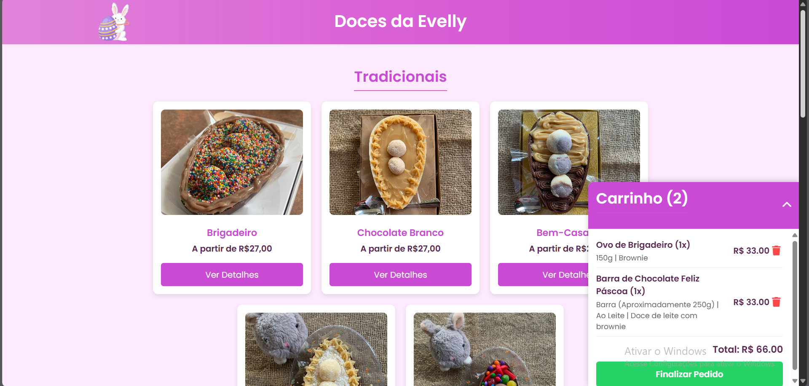
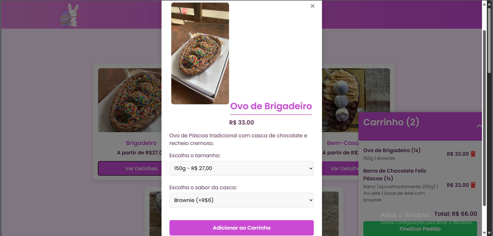

# 🍫 Doces da Evelly - Site de Páscoa

Este é um projeto pessoal desenvolvido para a lojinha de ovos de colher "Doces da Evelly", com o objetivo de transformar o cardápio de produtos em um site interativo, funcional e bonito — tudo isso como parte dos meus estudos em desenvolvimento web!

## 🚀 Funcionalidades

- Exibição dos produtos em cards por tipo de ovo
- Modal para seleção de sabores e tamanhos
- Preço atualizado dinamicamente com base nas escolhas do cliente
- Sistema de carrinho de compras com LocalStorage
- Botão para finalizar o pedido via WhatsApp com mensagem automática
- Layout responsivo (funciona bem em celular e desktop)
- Cores e identidade visual da lojinha aplicadas ao design

## 💠 Tecnologias utilizadas

- **HTML5**
- **CSS3**
- **JavaScript Puro**
- **LocalStorage**
- **GitHub Codespaces** (ambiente de desenvolvimento)

## 📷 Imagens do projeto

### Página inicial com cardápio:


### Seleção de sabores e carrinho:


> *(As imagens são prints reais do funcionamento do site)*

## 💡 Aprendizados

Esse projeto foi uma oportunidade de aplicar conhecimentos em:

- Manipulação do DOM com JavaScript
- Uso de eventos para interações do usuário
- Armazenamento de dados com LocalStorage
- Integração com o WhatsApp via link personalizado
- Organização de arquivos e lógica em projetos front-end

## 📲 Como testar

Você pode clonar este repositório e abrir o arquivo `index.html` diretamente no navegador, ou usar uma extensão como o Live Server (VS Code) para uma experiência melhor.

```bash
git clone https://github.com/seu-usuario/doces-da-evelly.git
```

---

## 📬 Contato

Caso queira trocar uma ideia ou tenha alguma sugestão:

- LinkedIn: (https://www.linkedin.com/in/luiz-gabriel-5a5b46277/)
- Instagram da loja: https://instagram.com/docesdaevelly_)

---

